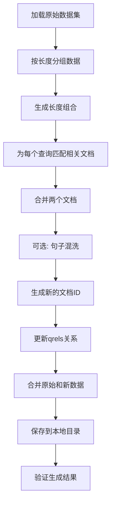

# LongEmbed扩展长度数据生成脚本说明

## 概述

`generate_extended_longembed_data.py` 是一个用于为LongEmbed数据集生成扩展长度评估数据的脚本。该脚本通过合并现有不同长度的文档来创建更长的评估数据，支持从33024到65536的多种长度组合。

## 核心设计理念

### 任务特性分析
- **s2p任务特点**：LEMBNeedleRetrieval和LEMBPasskeyRetrieval是sentence-to-paragraph任务
- **查询固定性**：查询(sentence)是短文本，保持不变
- **文档可扩展性**：段落(paragraph)可以通过合并来扩展长度
- **评估目标**：测试模型在更长文档中的检索能力

### 解决方案
**核心思路**：保持查询不变，通过合并两个不同长度的文档来创建目标长度的新文档，维持s2p任务的本质特征。

## 功能特性

### 1. 多长度组合支持
脚本支持8种预设长度组合：

| 基础长度 | 扩展长度 | 目标长度 | 用途描述 |
|---------|---------|---------|----------|
| 32768 | 256 | 33024 | 小幅扩展测试 |
| 32768 | 512 | 33280 | 渐进式测试 |
| 32768 | 1024 | 33792 | 中等扩展 |
| 32768 | 2048 | 34816 | 标准扩展 |
| 32768 | 4096 | 36864 | 大幅扩展 |
| 32768 | 8192 | 40960 | 超长扩展 |
| 32768 | 16384 | 49152 | 极长扩展 |
| 32768 | 32768 | 65536 | 双倍长度 |

### 2. 句子混洗功能
- **可选功能**：支持在合并文档时打乱句子顺序
- **分割规则**：按`.\n`分割文本成句子
- **随机控制**：使用种子控制随机性，确保可重现
- **独立处理**：两个文档使用不同种子避免模式重复

### 3. 自定义组合
- **灵活配置**：支持通过命令行参数自定义长度组合
- **格式要求**：`len1,len2,target` 格式
- **自动检测**：根据目标长度自动加载所需源数据

## 实现逻辑

### 数据处理流程



### 核心算法

#### 1. 文档合并策略
```python
def generate_s2p_combined_data(data1, data2, target_length, ...):
    # 优先选择与原查询相关的文档作为第一个文档
    for doc_id in original_doc_ids:
        if doc_id in corpus_dict1:
            doc1 = corpus_dict1[doc_id]
            break
    
    # 随机选择第二个文档
    doc2 = random.choice(corpus_list2)
    
    # 合并文档
    merged_text = first_doc_text + "\n\n--- Document Continuation ---\n\n" + second_doc_text
```

#### 2. ID生成规则
- **新查询ID**：`{原qid}_{目标长度}`
- **新文档ID**：`{doc1_id}_merged_{doc2_id}_{目标长度}`
- **保持关系**：qrels中维护查询与新文档的对应关系

#### 3. 句子混洗算法
```python
def shuffle_sentences(text: str, seed: int = 42) -> str:
    sentences = text.split('.\n')
    random.seed(seed)
    random.shuffle(sentences)
    return '.\n'.join(sentences)
```

### 数据质量保证

#### 1. 关系保持
- **查询不变**：查询文本完全保持原样
- **关联维护**：优先使用与原查询相关的文档作为合并基础
- **qrels更新**：正确建立新查询与新文档的关系

#### 2. 格式一致性
- **字段完整**：确保所有必需字段存在
- **类型正确**：context_length为整数，text为字符串
- **空值处理**：qrels中text字段为空字符串""而非null

#### 3. 验证机制
- **长度验证**：检查生成文档的实际字符长度
- **标识验证**：确认合并标识符"Document Continuation"存在
- **统计输出**：显示各长度数据的生成数量

## 使用方式

### 基础用法

```bash
# 生成所有预设长度组合的数据
python generate_extended_longembed_data.py
```

### 带句子混洗

```bash
# 启用句子混洗功能
python generate_extended_longembed_data.py --shuffle-sentences --shuffle-seed 42
```

### 自定义长度组合

```bash
# 生成特定长度组合
python generate_extended_longembed_data.py --combinations 32768,256,33024 32768,512,33280

# 单个组合
python generate_extended_longembed_data.py --combinations 32768,4096,36864
```

### 参数说明

| 参数 | 类型 | 默认值 | 说明 |
|------|------|--------|------|
| `--shuffle-sentences` | flag | False | 是否启用句子混洗功能 |
| `--shuffle-seed` | int | 42 | 句子混洗的随机种子 |
| `--combinations` | str list | None | 自定义长度组合，格式：len1,len2,target |

## 输出结构

### 目录结构
```
/home/kdump/llm/project/LongEmbed/
├── local_data/
│   ├── needle/
│   │   ├── queries.jsonl      # 包含原始+扩展查询
│   │   ├── corpus.jsonl       # 包含原始+扩展文档
│   │   └── qrels.jsonl        # 包含原始+扩展关系
│   └── passkey/
│       ├── queries.jsonl
│       ├── corpus.jsonl
│       └── qrels.jsonl
└── generate_extended_longembed_data.py
```

### 数据格式示例

#### 查询格式 (queries.jsonl)
```json
{
  "qid": "LEMBNeedleQA_en_0_33024",
  "text": "What is the capital of France?",
  "context_length": 33024
}
```

#### 文档格式 (corpus.jsonl)
```json
{
  "doc_id": "LEMBNeedleInDomain_en_0_merged_LEMBNeedleInDomain_en_1_33024",
  "text": "First document text...\n\n--- Document Continuation ---\n\nSecond document text...",
  "context_length": 33024
}
```

#### 关系格式 (qrels.jsonl)
```json
{
  "qid": "LEMBNeedleQA_en_0_33024",
  "doc_id": "LEMBNeedleInDomain_en_0_merged_LEMBNeedleInDomain_en_1_33024",
  "text": "",
  "context_length": 33024
}
```

## 验证和质量检查

### 自动验证功能
脚本执行完成后会自动进行以下验证：

1. **数据完整性检查**
   - 验证生成的文件是否存在
   - 检查各长度数据的数量统计

2. **样本质量检查**
   - 抽样检查生成文档的实际字符长度
   - 验证合并标识符是否正确插入
   - 检查查询文本的前50个字符

3. **统计信息输出**
   - 显示每种长度的数据生成数量
   - 提供详细的数据分布情况

### 手动验证建议

```bash
# 检查生成的数据文件
ls -la local_data/needle/
ls -la local_data/passkey/

# 查看数据量统计
wc -l local_data/needle/*.jsonl
wc -l local_data/passkey/*.jsonl

# 检查样本内容
head -1 local_data/needle/corpus.jsonl | jq .
```

## 注意事项

### 1. 数据依赖
- 需要网络连接从Hugging Face下载原始LongEmbed数据集
- 确保有足够的磁盘空间存储生成的数据

### 2. 性能考虑
- 生成过程可能需要几分钟时间
- 内存使用量取决于数据集大小

### 3. 兼容性
- 生成的数据与修改后的LEMBNeedleRetrieval.py和LEMBPasskeyRetrieval.py兼容
- 需要配合test_openai_long_embed_local.py进行评估

## 相关文件

- `generate_extended_longembed_data.py` - 主要的数据生成脚本
- `modify_retrieval_classes.py` - 修改MTEB任务类的脚本
- `src/test_openai_long_embed_local.py` - 本地评估脚本
- `mteb/tasks/Retrieval/eng/LEMBNeedleRetrieval.py` - 修改后的Needle任务类
- `mteb/tasks/Retrieval/eng/LEMBPasskeyRetrieval.py` - 修改后的Passkey任务类

## 技术原理总结

这个方案充分利用了s2p任务的特性：**查询固定、文档可扩展**，通过合理的文档合并策略实现了从33024到65536等多种长度的评估数据生成。关键创新点在于保持了任务的本质特征（短查询在长文档中检索），同时扩展了评估的长度范围，为长文档检索模型提供了更全面的测试环境。 